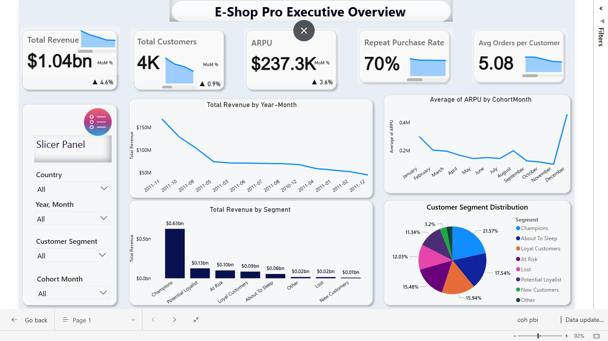
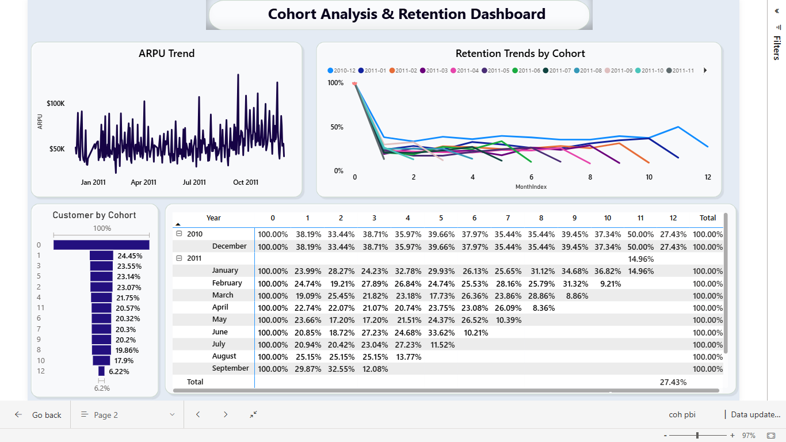
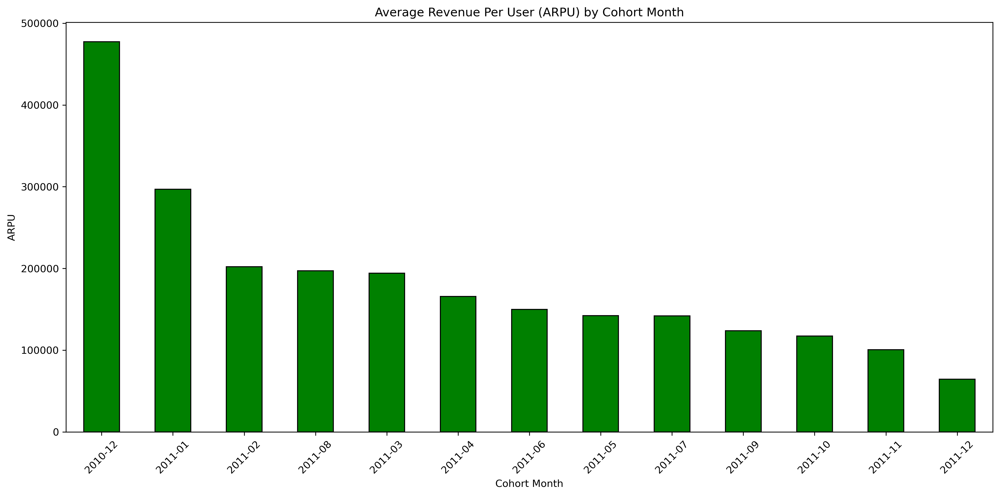
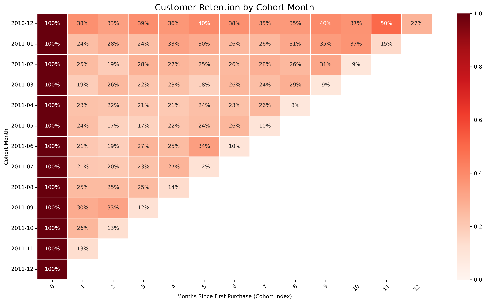
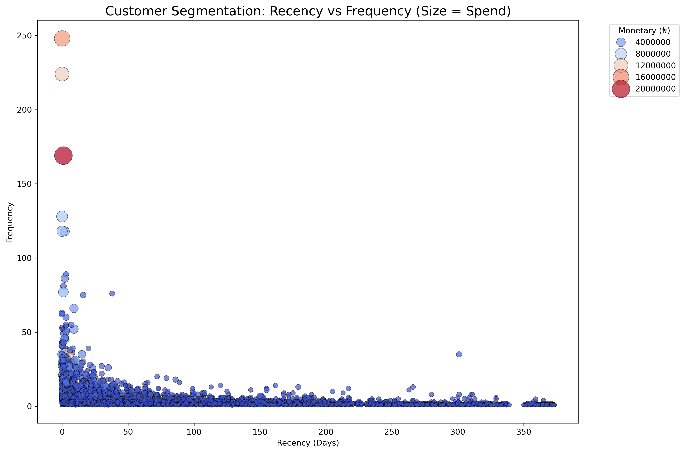
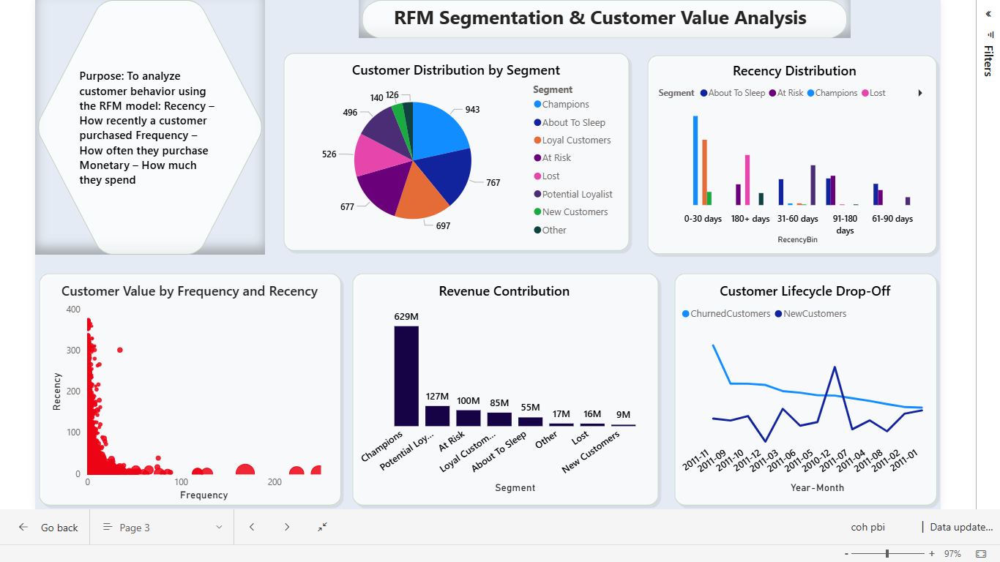
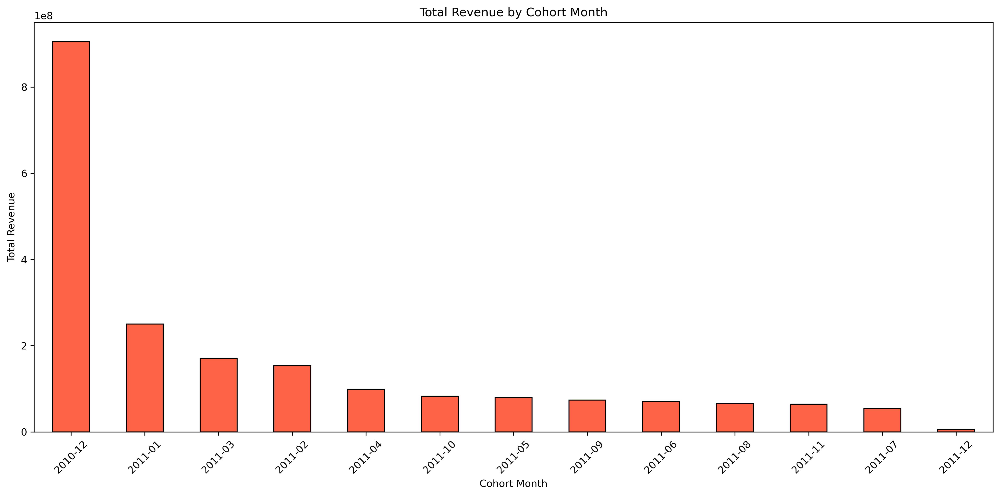
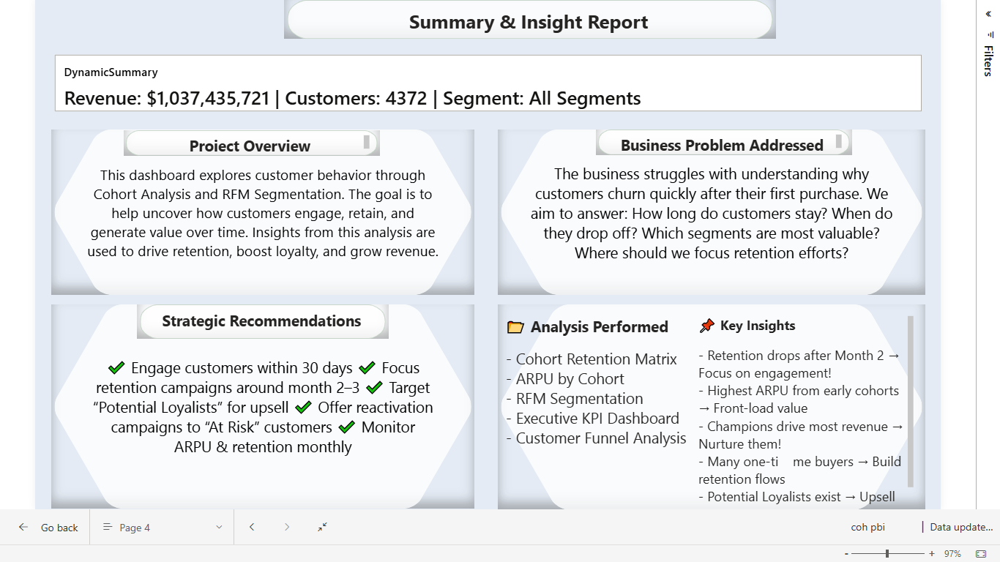

# Customer Cohort & Retention Analysis | Power BI Dashboard

This Power BI dashboard dives into customer retention, cohort analysis, and lifetime value across a 12-month transactional dataset.

Built on top of a prior Python-based cohort analysis, this Power BI project focuses on delivering business-ready insights using advanced DAX, interactive visuals, and clean storytelling.

---

## 🔍 Business Objective

To help the company understand **customer lifecycle behavior**:
- When do customers churn?
- What segments are most loyal?
- How do different cohorts behave over time?
- What is the ARPU trend, and how is it distributed?

---

## 📊 Dashboard Pages Overview

### 1. **Executive Summary**
- Revenue, ARPU, and Customer KPIs
- Month-over-Month trends
- Dynamic slicer panel with toggle button

### 2. **Cohort Retention**
- Customer retention matrix
- Cohort ARPU and revenue trend
- Retention funnel + analysis

### 3. **RFM Segmentation**
- RFM scatter plot
- Segment distribution (pie chart)
- Behavioral customer clusters

### 4. **Insights Summary**
- Key takeaways
- Dashboard usage instructions
- Business recommendations

## 📊 Dashboard Visuals (Power BI Report)

### 🔹 Executive Summary Page  

### 🔹 Customer Cohort & Retention Analysis  

### 🔹 ARPU by Cohort  

### 🔹 Retention Heatmap  

### 🔹 RFM Analysis – Scatter Plot  

### 🔹 RFM Segment Distribution  

### 🔹 Revenue Trend by Cohort  

### 🔹 Summary and Business Insight  

---

### Key Learnings & Tools Used
Power BI DAX: Dynamic cohort retention logic, RFM segmentation

Bookmarks & Toggle Panel: Advanced UI interactivity

Slicer Syncing: Controlled visuals by date/segment filters

Custom Tooltips & KPI cards: Enhanced storytelling

Python Preprocessing (initial cohort prep)

### 🔗 Related Projects
If you're curious about the Python version of this analysis:
👉 [Customer Cohort Analysis in Python
](https://github.com/Psychizzy/customer-cohort-analysis)

## Insights Summary
Most churn happens after the 1st or 2nd month

ARPU varies significantly by cohort and country

RFM analysis shows large base of inactive customers

Executive KPIs provide quick health checks of revenue and retention

Contact
Feel free to connect on LinkedIn or fork and explore the dashboard.

## 📁 Dataset Access

### ⚠️Note;
 Due to GitHub’s file size limitations, the dataset is not included in this repository.

This dataset was used strictly for educational and portfolio purposes.  
If you'd like access to explore or replicate this analysis, feel free to reach out!

